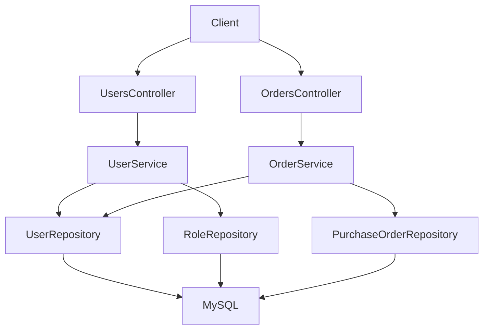
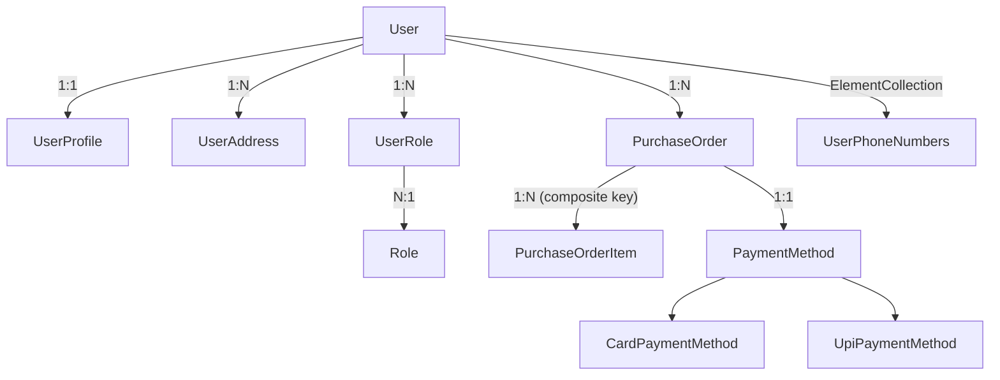

# Advance ORM (Spring Boot + JPA/Hibernate + MySQL)

`advance-orm` is a demo project showing advanced ORM patterns with Spring Data JPA + Hibernate 6 on MySQL.

## Tech Stack

- Java 17
- Spring Boot 3.5.11
- Spring Web
- Spring Data JPA (Hibernate 6)
- Flyway migrations
- MySQL 8.4
- Testcontainers (MySQL) for integration tests

## Project Structure

- `src/main/java/com/example/advance_orm/controller`: REST controllers (`UsersController`, `OrdersController`)
- `src/main/java/com/example/advance_orm/services`: service interfaces + implementations
- `src/main/java/com/example/advance_orm/repository`: Spring Data repositories + custom Criteria API repo
- `src/main/java/com/example/advance_orm/domain`: entities and mapping model
- `src/main/java/com/example/advance_orm/dto`: request/response DTOs
- `src/main/resources/db/migration`: Flyway SQL migrations

## High-Level Flow



## Domain Model (How Entities Are Connected)



### Advanced ORM Features Used

- Soft delete on `User` (`@SQLDelete`, `@SQLRestriction`)
- JSON column mapping:
  - `users.preferences`
  - `purchase_orders.metadata`
- Composite keys:
  - `UserRoleId`
  - `PurchaseOrderItemId`
- Inheritance:
  - `PaymentMethod` base
  - `CardPaymentMethod`, `UpiPaymentMethod` subclasses
- Auditing:
  - `AuditMetadata` embedded in multiple entities
- Optimistic locking:
  - `@Version` on `User` and `PurchaseOrder`
- Fetch tuning:
  - `@EntityGraph` and fetch-join query

## API Endpoints

Base URL: `http://localhost:8089`

### Users

#### Create User

- `POST /api/users`
- Request body:

```json
{
  "email": "alice@example.com",
  "displayName": "Alice",
  "status": "ACTIVE",
  "preferences": {
    "theme": "dark"
  },
  "phoneNumbers": ["9999999999"],
  "addresses": [
    {
      "label": "home",
      "line1": "Street 1",
      "city": "Bengaluru",
      "postalCode": "560001",
      "country": "IN"
    }
  ],
  "roleCodes": ["ADMIN"],
  "profileBio": "Senior user",
  "profileAvatarUrl": "https://example.com/avatar.png"
}
```

- Response: `201 Created` with `UserResponse`

#### List Users (Pagination + Specification Filter)

- `GET /api/users?query=<text>&status=<ACTIVE|SUSPENDED>&page=0&size=20`
- Response: paged `UserListItem`

#### Get User

- `GET /api/users/{id}?details=true`
- `details=true` triggers entity graph loading (profile, addresses, roles, phones)

#### Criteria Search

- `GET /api/users/search/criteria?text=<text>&status=<ACTIVE|SUSPENDED>&limit=50`

#### Delete User (Soft Delete)

- `DELETE /api/users/{id}`
- Response: `204 No Content`

---

### Orders

#### Create Order

- `POST /api/orders`
- Request body:

```json
{
  "userId": 1,
  "metadata": {
    "source": "mobile"
  },
  "items": [
    { "sku": "SKU-1", "quantity": 2, "unitPrice": 99.99 },
    { "sku": "SKU-2", "quantity": 1, "unitPrice": 49.5 }
  ],
  "payment": {
    "type": "CARD",
    "cardLast4": "1234",
    "cardNetwork": "VISA",
    "vpa": null
  }
}
```

- Response: `201 Created` with `OrderResponse`

#### Get Order

- `GET /api/orders/{id}?details=true`
- `details=true` uses entity graph for `items` and `paymentMethod`

## Database and Migration

- Flyway migration file: `src/main/resources/db/migration/V1__init.sql`
- Hibernate mode: `ddl-auto: validate` (MySQL profile)
- Main schema includes:
  - `users`, `user_profiles`, `user_addresses`, `roles`, `user_roles`, `user_phone_numbers`
  - `purchase_orders`, `purchase_order_items`, `payment_methods`

## Run Locally

### 1) Start MySQL with Docker Compose

```bash
docker compose up -d
docker compose ps
```

### 2) Start Application

```bash
./mvnw spring-boot:run
```

### 3) Run Tests

```bash
./mvnw test
```

## Important Notes / Troubleshooting

### 1) `No services to build` Warning

This is expected for this project because compose uses `image:` (not `build:`). It is not an error.

### 2) MySQL exits with "password option is not specified"

Ensure compose includes all of these:

- `MYSQL_USER`
- `MYSQL_PASSWORD`
- `MYSQL_ROOT_PASSWORD`

### 3) Port conflict on `3306`

If another MySQL container is already running, you can see:

`Bind for 0.0.0.0:3306 failed: port is already allocated`

Fix:

```bash
docker ps
docker stop <conflicting_container_name>
docker compose up -d
```

### 4) Two containers with different names (example: `advance-orm-mysql`, `jso-mysql-1`)

This happens when Docker Compose is run from different folders/projects. Compose project name is folder-based by default.

To enforce one project name:

```bash
docker compose -p advance-orm up -d
```

### 5) Reset database volume

```bash
docker compose down
docker volume rm <project_name>_mysql_data
docker compose up -d --force-recreate --remove-orphans
```

